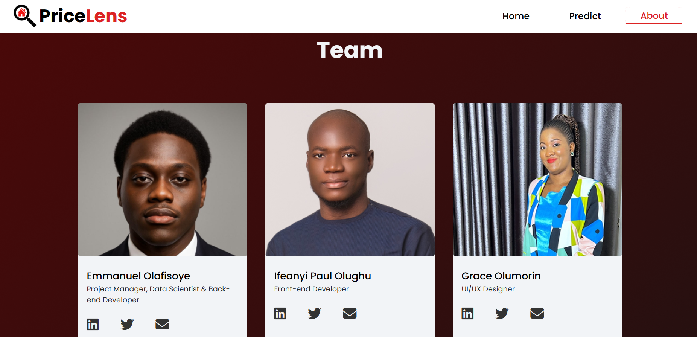

# PriceLens: Smart House Price Estimation

[](https://price-lens-project.vercel.app/)

## Author

**Olafisoye Emmanuel**  
[](https://www.linkedin.com/in/emmanuel-olafisoye/)

## What is PriceLens?

PriceLens is a web application that predicts house prices in Lagos and Abuja, Nigeria. Whether you're looking to rent or buy, simply input your property preferences and get an instant price estimate.

The Nigerian real estate market can be unpredictable, with prices varying wildly and scams being common. PriceLens uses machine learning to provide transparent, data-driven price estimates that help both locals and diaspora citizens make informed decisions.

## How it works

Visit the web app and enter basic property details:
- Location (Lagos or Abuja)
- Specific area or town
- Number of bedrooms
- Number of bathrooms
- Number of toilets
- Property type (flat, duplex, detached house, etc.)

Hit submit and get instant rent or sale price estimates based on historical market data.

## Screenshots

### Homepage
The landing page introduces PriceLens with a simple call to action.


### Prediction Form
Users can enter property details like location, bedrooms, bathrooms, and property type to get instant price estimates.


### Prediction Results
Users get to see thier estmiated price from pricelens as a pop-up.


### About the team page
Users get to see the persons who were responsible for the project, and what contribution they made. They can also send them mails, check their twitter account, as well as their linkedIn account. 
  

## The problem we're solving

The Nigerian property market has several challenges:
- Inflated and inconsistent pricing
- Limited transparency in price setting
- Difficulty for diaspora citizens to assess fair market rates
- Potential for scams due to information asymmetry

PriceLens addresses these issues by providing objective, algorithm-based price estimates anyone can access for free.

## Technical details

**Frontend**: Built with HTML, CSS, and JavaScript for a clean, responsive interface  
**Backend**: Python Flask API that processes requests and returns predictions  
**Machine Learning**: Gradient Boosting Regressor model trained on 2023 property data  
**Data Processing**: Pandas and NumPy for data cleaning and feature engineering  
**Deployment**: Frontend on Vercel, backend on Render for reliable hosting  

## Model performance

Our machine learning model achieves:
- R-squared score of 0.79 (explains 79% of price variation)
- Root Mean Square Error of approximately 29 million Naira (equivalent to about 12% of the average price in the dataset)

While these metrics indicate reasonable performance for trend analysis, actual prices may differ due to market changes since our training data.

## Dataset information

We used a Nigerian real estate dataset containing property listings from 2023 (gotten from kaggle). The data includes properties from Lagos and Abuja with features like location, property type, size, and historical prices.

**Dataset access**: [View/Download Dataset](https://drive.google.com/file/d/18V9u1efQ8nftYJbVYSLHjYU_ZB1JsOh9/view?usp=sharing) (nigeria_houses_data.csv)

**Data challenges we addressed:**
- Removed duplicate listings and incomplete records
- Standardized location names and property categories
- Separated rental and sale transactions for accurate modeling
- Filtered extreme outliers that could skew predictions

## Current limitations

**Geographic scope**: Only covers Lagos and Abuja, missing other major Nigerian cities  
**Data freshness**: Based on 2023 data, may not reflect current market conditions  
**Economic factors**: Doesn't account for policy changes, inflation, or economic shifts  
**Property details**: Limited features compared to what affects real-world pricing  

## What's next

We're planning several improvements:
- Integration with live property APIs for real-time data
- Expansion to other Nigerian cities like Port Harcourt and Kano
- Additional features like property size, amenities, and neighborhood ratings
- Advanced modeling techniques for better accuracy
- Interactive visualizations showing market trends

## How to Use

1. Clone the repository  
    ```bash
   git clone https://github.com/korie-cyber/PriceLens-project.git
   cd PriceLens-project
    ```
2. Set up your Python environment (using venv, pipenv, or conda):
    - python -m venv venv
    - source venv/bin/activate  # macOS/Linux
    - venv\Scripts\activate     # Windows
    - pip install -r requirements.txt

3. Run the Flask backend:
    - cd backend
    - flask run

4. Launch the frontend—open frontend/index.html in your browser or deploy locally (if there's a dev server script).

5. Navigate to http://localhost:5000, fill in features (location, number of bedrooms/bathrooms/toilets, etc.), and view the predicted prices.


## Acknowledgments

Thanks to FlexiSAF for the opportunity to work on this project during our Data Science and Generative AI internship. Special appreciation to my team members and collaborators who contributed their skills and support throughout development.

## Why we built this

PriceLens began as our final project during the Data Science and Generative AI internship training at FlexiSAf. We wanted to work on something that actually matters to people's lives, not just another theoretical exercise. The Nigerian housing market affects millions of people every day, and we saw an opportunity to use our newly learned skills to make a difference.

Beyond solving a real problem, this project let us showcase everything we'd learned - data collection, machine learning, web development, and deployment. We genuinely believe that technology should make life easier and more fair, especially in areas like housing where information gaps can cost people serious money.

The project showcases end-to-end development: data collection and cleaning, machine learning model training, web application development, and cloud deployment. It's designed to be a portfolio piece that solves genuine problems.

## Contributing

This is an open project welcoming contributions. Whether you want to improve the model, add new features, or extend coverage to more cities, we'd love your input. The codebase is structured for easy modification and extension.

For collaborations: 
    ```bash
    git checkout -b feature-branch
    git commit -m "Add new feature"
    git push origin feature-branch
    ```

## Disclaimer

PriceLens provides estimates based on historical data and should not be the sole factor in property decisions. Always conduct additional research and consult local real estate professionals before making significant financial commitments. Market conditions change rapidly, and our predictions may not reflect current pricing.